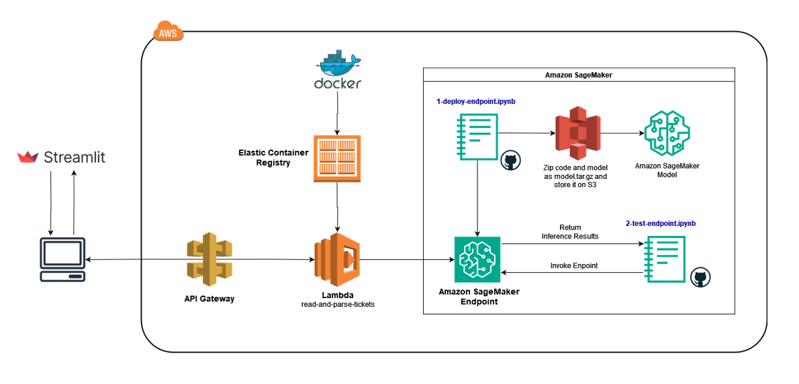
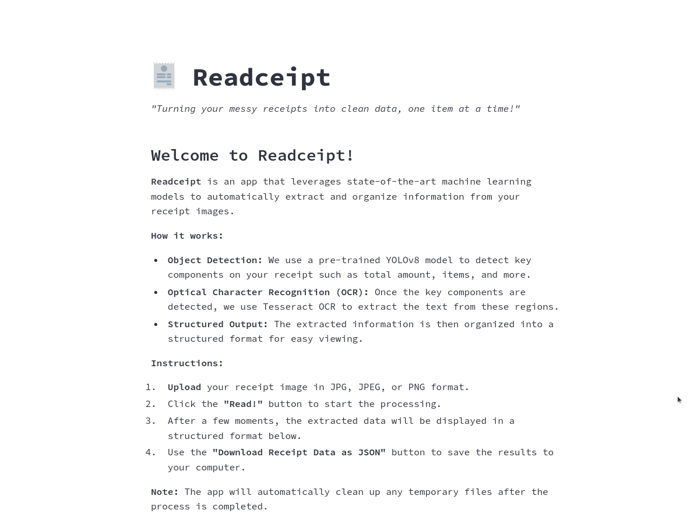

# Extracción Automatizada de Datos de Tickets de Compra mediante YOLOv8 y Pytesseract en AWS Cloud

## Descripción

Este proyecto es el trabajo final del máster en [Ciencia de Datos e Ingeniería de Datos en la Nube de la Universidad de Castilla-La Mancha](http://www.cidaen.es/). Su objetivo es desarrollar una aplicación capaz de convertir automáticamente la información contenida en tickets de compra en datos de texto estructurado, optimizando la gestión de información financiera. Para lograr esto, se combina un algoritmo de detección de objetos con un algoritmo de reconocimiento óptico de caracteres (OCR).

El proyecto se divide en dos fases principales:

1. **Detección de Objetos con YOLOv8**: Se entrena el modelo YOLOv8 de Ultralytics utilizando un conjunto de datos de tickets de compra. El modelo está diseñado para identificar y extraer cinco clases esenciales: nombre del comercio, dirección del comercio, fecha de facturación, artículos de compra y la cantidad total.

2. **Reconocimiento Óptico de Caracteres (OCR) con Tesseract**: Una vez que los elementos clave han sido identificados y extraídos de la imagen, se utiliza Tesseract para realizar OCR y convertir los datos visuales en texto editable.

## Estructura

La estructura del proyecto es la siguiente:

```
├── README.md                       <- Project overview and instructions.
│
├── LICENSE                         <- License for the project's usage.
│
├── assets
│
├── app                             <- Main application code and configuration settings for the web app.
│   ├── app.py
│   └── .streamlit
│       └── config.toml
│    
├── data
│   ├── images                      <- Unaltered data.
│   ├── train                       <- Training dataset and labels.
│   ├── valid                       <- Validation dataset and labels.
│   └── test                        <- Test dataset and labels.
│
├── aws-lambda-image
│   ├── Dockerfile                  <- Docker configuration for AWS Lambda deployment.
│   ├── app.py                      <- Lambda function code.
│   └── requirements.txt            <- Dependencies for the Lambda function.
│
├── .gitignore
│
├── requirements.txt                <- Dependencies for the project.
│ 
└── notebooks                                         <- Jupyter notebooks.
    ├── colab
    │   ├── 1-training-yolov8-on-receipts-data.ipynb  <- Code to train the model on receipts data.
    │   ├── runs/                                     <- Output files from the model training.
    │   └── config.yaml                               <- Configuration settings for Colab training.
    │
    ├── local
    │   ├── 1-testing-yolov8-local-setup.ipynb        <- Testing code using the trained model locally.
    │   └── 2-testing-yolov8-aws-setup.ipynb          <- Testing code using the trained model deployed on SageMaker.
    │
    └── sagemaker
        ├── 1-deploy-sm-endpoint.ipynb                <- Code to deploy the trained model on SageMaker.
        ├── 2-test-sm-endpoint.ipynb                  <- Code to test the endpoint deployed on SageMaker.
        ├── model.tar.gz                              <- Compressed model and inference code stored on S3.
        └── code
            ├── inference.py                          <- Inference script for PyTorchModel on SageMaker.
            └── requirements.txt                      <- Dependencies for SageMaker inference.
```

## Instalación

1. Clona este repositorio en tu máquina local:
   ```bash
   git clone https://github.com/jadelaossa/automatic-receipts-recognition.git
   ```

2. Navega al directorio del proyecto:
   ```bash
   cd automatic-receipts-recognition
   ```

3. Instala los paquetes necesarios:
   ```bash
   pip install -r requirements.txt
   ```

## Arquitectura

La arquitectura del proyecto está diseñada para aprovechar AWS Cloud, con componentes que incluyen Amazon SageMaker para el despliegue del modelo YOLOv8 y AWS Lambda para el procesamiento de las imágenes. La siguiente imagen ilustra esta arquitectura:



## Demo

La siguiente animación muestra cómo la aplicación procesa la imagen de un ticket de compra y extrae sus datos:



## Licencia

Este proyecto está bajo la Licencia MIT. Consulta el archivo `LICENSE` para más detalles.

## Contacto

Para cualquier pregunta, puedes contactarme a través de javdelfer@gmail.com.